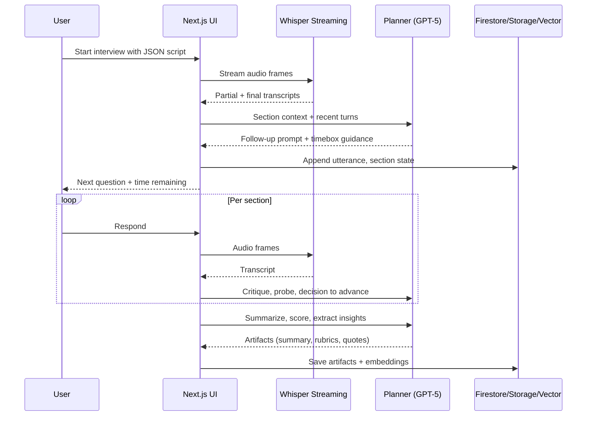

## Interview Agent – Configurable, domain‑agnostic AI interviewer

A production‑ready, semi‑structured AI interviewer that runs from a JSON script, asks smart off‑script follow‑ups while staying within per‑section time limits, and outputs transcripts, structured data, summaries/insights, visualizations, and exports. It also exposes a simple query layer so an LLM (or you) can answer questions over collected interviews.

### Why this exists

- **Consistency at scale**: Run comparable interviews across domains (consulting, medicine, law, research) with clear timeboxing.
- **Intelligence**: Follow up naturally, based on what the candidate just said, without drifting from the section goals.
- **Structured outcomes**: End with high‑quality transcripts, section scores, evidence, summaries, and exports you can share.

## Feature set

- **Script‑driven interviews**: JSON “script” with sections `{ id, prompt, targetDurationSec }`.
- **Smart follow‑ups**: On‑the‑fly probing informed by recent utterances, section intent, and rubric.
- **Timeboxing**: Per‑section timers with soft nudges and hard transitions; section grace windows.
- **Domain agnostic**: Domain adapters (consulting cases, medical OSCEs, legal hypotheticals, research protocols) loaded at runtime.
- **Streaming STT**: Whisper streaming for low‑latency diarized transcripts; fallback to mock mode.
- **LLM orchestration**: GPT‑5 Thinking for planning, critique, evidence‑tracking, and safe‑guarded generation.
- **Artifacts**: Full transcript, structured section data, rubrics, summaries, insights, scores, and key quotes.
- **Visualizations**: Talk‑time, turn‑taking, topic map, sentiment/energy over time, section progress.
- **Exports**: JSON, CSV, PDF; per‑section packets and full bundle.
- **Query layer**: Ask natural‑language questions over interviews using a vector DB and SQL‑like operators.
- **Auth & multi‑tenant**: Firebase Auth; Firestore for sessions; Storage for audio blobs and exports.

## High‑level architecture

```mermaid
flowchart LR
  subgraph Client [Next.js App (Edge+RSC)]
    UI[Interview UI]
    Mic[Mic/WebAudio]
    Viz[Visualizations]
    UI --> Mic
  end

  subgraph Realtime
    WS[WebSocket/WebRTC]
    STT[Whisper Streaming]
  end

  subgraph Orchestrator
    Planner[LLM Planner\n(GPT-5 Thinking)]
    ScriptEng[Script Engine\n& Timebox]
    Followup[Follow-up Generator]
  end

  subgraph Data
    FS[(Firestore)]
    Store[(Firebase Storage)]
    Vec[(Vector DB - optional)]
  end

  Mic --> WS --> STT --> Orchestrator
  UI <--> WS
  Orchestrator --> ScriptEng
  Orchestrator --> Planner --> Followup --> UI
  Orchestrator <--> FS
  Store <--> UI
  Orchestrator --> Vec
  UI --> Viz
```

### Typical interview flow



## Tech stack

- **Frontend**: Next.js 14+ (App Router, RSC), React 18, Tailwind.
- **Realtime audio**: WebRTC/WebSocket to a **Whisper streaming** service (or mock STT for local).
- **LLM**: GPT‑5 Thinking for planning, critique, and follow‑ups.
- **Auth**: Firebase Auth (Email/Password, OAuth providers).
- **Database**: Firestore (sessions, sections, utterances, artifacts).
- **Blob storage**: Firebase Storage (audio, PDFs, exports).
- **Vector DB (optional)**: pgvector, Pinecone, Weaviate, or Firestore+Lite index for small deployments.
- **Background jobs**: Next.js Route Handlers / Edge Functions; optional queue (Cloud Tasks).
- **Charts**: Tremor or Recharts; D3 for custom timelines.

## JSON interview script

Example minimal script for a “hello interview”:

```json
{
  "title": "Hello Interview",
  "sections": [
    {
      "id": "intro",
      "prompt": "Warm-up: Tell me about yourself.",
      "targetDurationSec": 45
    },
    {
      "id": "case",
      "prompt": "Quick case: Estimate daily coffees sold on campus.",
      "targetDurationSec": 90
    },
    {
      "id": "wrap",
      "prompt": "Wrap-up: Any questions for us?",
      "targetDurationSec": 30
    }
  ]
}
```

## Local development

### Prerequisites

- Node.js 20+
- pnpm or npm
- Firebase CLI (for emulators)
- Optional: ffmpeg (audio tooling)

### Environment

Create `.env.local` at repo root:

```bash
# OpenAI
OPENAI_API_KEY=sk-...
AI_MODE=mock                # mock | live

# Whisper streaming (set when live)
WHISPER_SERVER_URL=http://localhost:8081

# Firebase
NEXT_PUBLIC_FIREBASE_API_KEY=...
NEXT_PUBLIC_FIREBASE_AUTH_DOMAIN=...
NEXT_PUBLIC_FIREBASE_PROJECT_ID=...
NEXT_PUBLIC_FIREBASE_STORAGE_BUCKET=...
NEXT_PUBLIC_FIREBASE_APP_ID=...
FIREBASE_EMULATORS=1        # use local emulators in dev

# Vector DB (optional)
VECTOR_DB=pinecone          # pinecone | weaviate | pgvector | none
VECTOR_DB_URL=...
VECTOR_DB_API_KEY=...
```

### Install & run (mock mode by default)

```bash
pnpm install
pnpm dev
```

Then open `http://localhost:3000`.

If using Firebase emulators:

```bash
pnpm firebase:emulators
```

## Quickstart: run a “hello interview” end‑to‑end (mock mode)

Mock mode uses a local STT and LLM stub—no external API calls.

1. Save the example script to `scripts/hello.json`.
2. Start the app in mock mode:
   ```bash
   AI_MODE=mock STT_MODE=mock pnpm dev
   ```
3. In the UI, open `/mock` and click “Start Hello Interview”.
4. Speak or type responses. You will see:
   - live transcript,
   - timeboxed sections with progress,
   - follow‑up questions,
   - final summary, insights, and exports.
5. Exports are written to `Storage` (mocked to `./.local/storage`) and JSON to `Firestore` (mocked to `./.local/firestore`).

CLI fallback (no UI):

```bash
pnpm tsx scripts/hello-interview.ts --script scripts/hello.json --mode mock
```

This runs a headless session and prints a transcript, section artifacts, and a final summary to stdout.

## Query layer (ask questions over interviews)

- Natural‑language: “Show top 5 follow‑ups that improved scores in case sections.”
- Structured: filter, group, aggregate over sessions/sections/utterances.
- Backed by embeddings (vector DB) + metadata in Firestore; results are cite‑backed to original turns.

Example prompt:

```text
For all interviews tagged "consulting", compute average talk‑time ratio per section and list the top 3 high‑leverage follow‑up prompts with evidence links.
```

## Data model (high level)

- **Session**: id, scriptRef, startedAt, endedAt, tenantId, participant, device, tags.
- **Section**: id, prompt, targetDurationSec, startedAt, endedAt, overrunSec, rubric.
- **Utterance**: id, speaker, text, startMs, endMs, confidence, annotations.
- **Artifacts**: summary, insights[], scores[], quotes[], exports[].
- **Embeddings**: per utterance + per section summaries for retrieval.

## Security & privacy

- Explicit consent message before recording.
- Local‑first during capture; redact PII before upload (configurable policies).
- Tenant‑scoped access control via Firebase rules.

## Roadmap (selected)

- Live rubric scoring and calibration
- Multilingual STT + translation
- Interview review copilot over artifacts
- Rich query DSL with saved queries and dashboards

## License

MIT

## Contributing

PRs welcome. Open an issue with the use‑case and scope. For larger changes, include a brief proposal.
